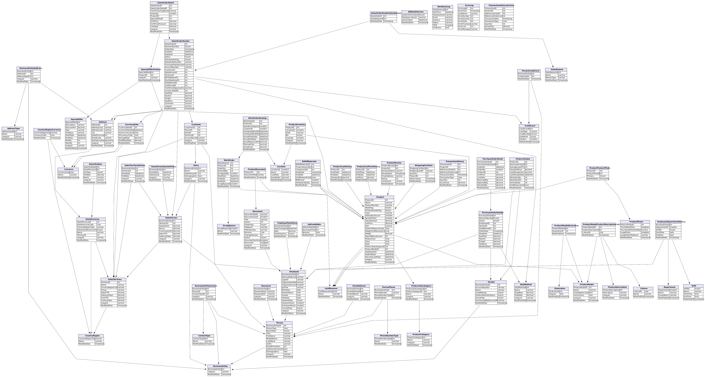
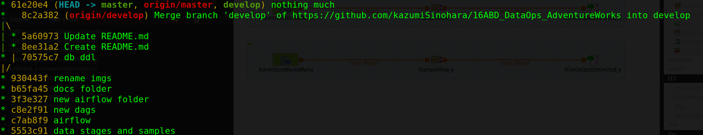
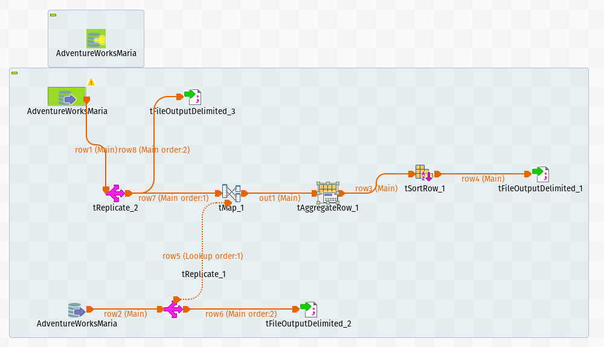
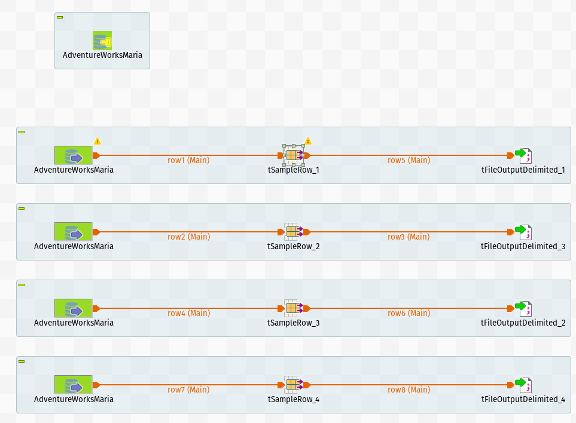
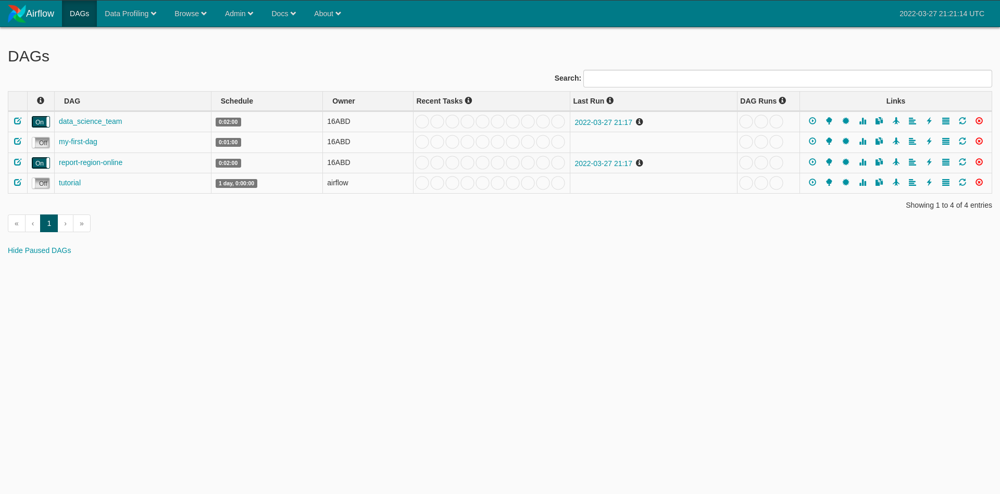
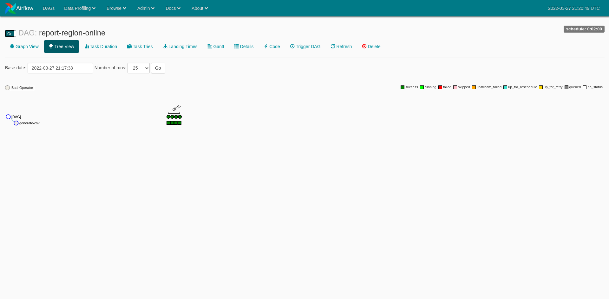
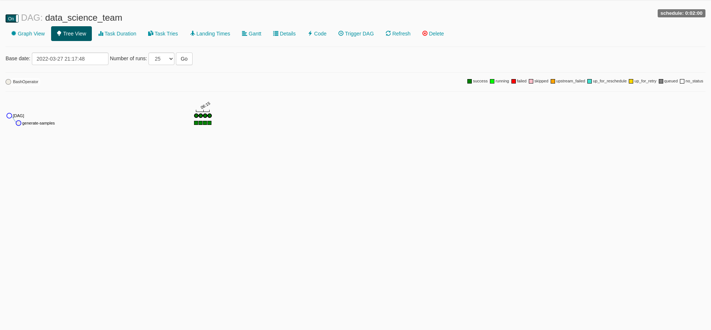

# 16ABD_DataOps_AdventureWorks

Gerson Kazumi Sinohara 341011
Rodrigo Jean 340501
Thomas Saheki 341903

DDL da base AdventureWorks (Maria DB)

## Branches do gitFlow

## Talend Pipeline
Pipeline para o time de BI com uma camada Raw e e outra de dados tratados

Pipeline para o time de ciência de dados com amostras das tabelas relevantes para construção do modelo de churn

## Airflow Dags
Painel do Airflow com as duas dags (BI e DS)

Execução da DAG de BI

Execução da DAG de DS

